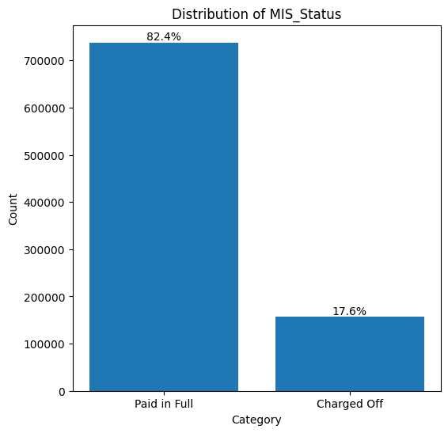
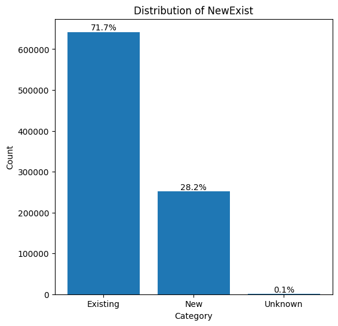
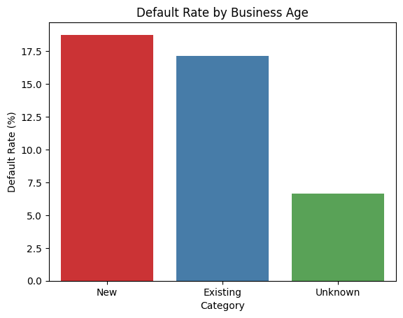
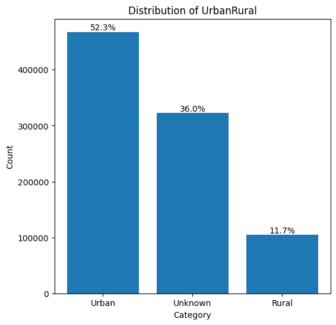
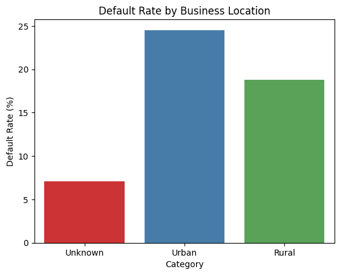
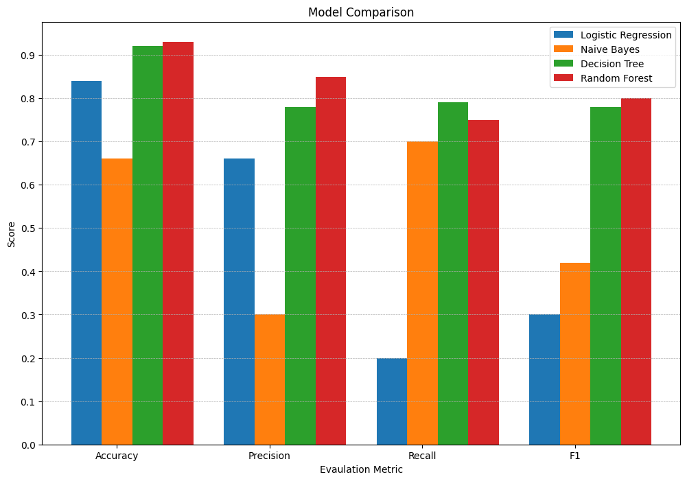
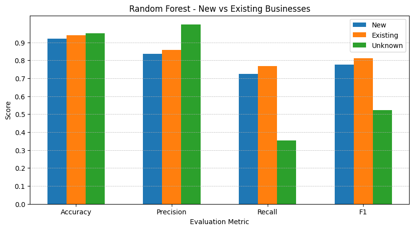
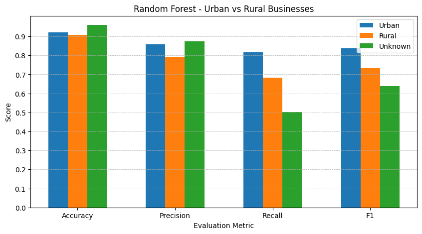
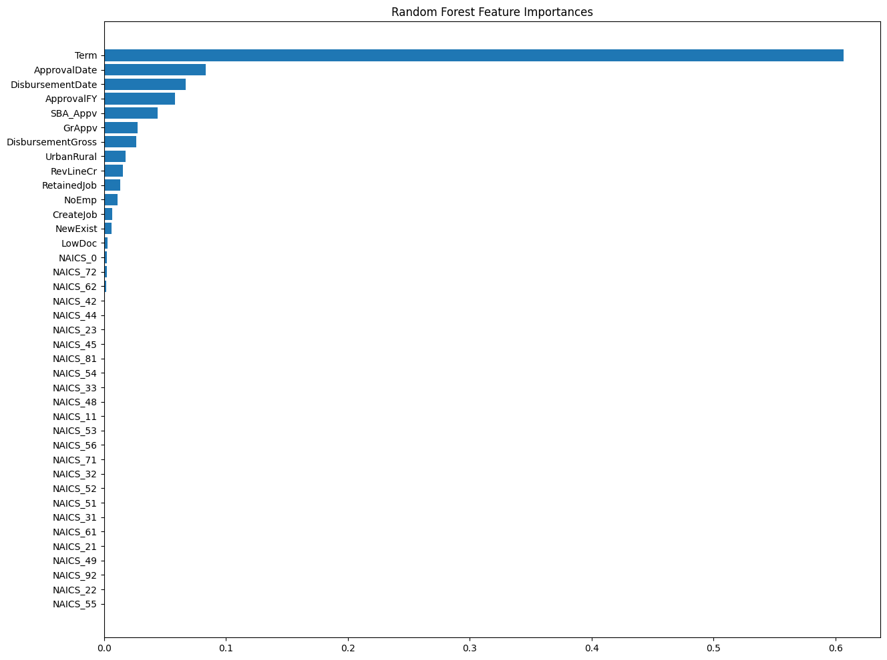

# Predicting Loan Defaults

In this project, we want to look at a predictive analytics problem: predicting loan defaults. Based on information about a given loan, can we predict whether the loan will default or be paid off? The data set we are using to tackle this problem is an open-access data set from the U.S. Small Business Administration (SBA), recording data about government-backed SBA loans and whether they were paid off. This data set was prepared and published with the paper ["Should This Loan be Approved or Denied?": A Large Dataset with Class Assignment Guidelines](https://doi.org/10.1080/10691898.2018.1434342) by Li, Mickel, and Taylor, published in 2018 in the Journal of Statistics Education.

The learning concept for this data set and our problem is "defaults on loan": that a borrower fails to pay off their loan. Our goal is to predict whether they will pay off the loan or not using variables that are available when the loan is issued.

## About the Data

The dataset includes detailed records of small business loans issued and guaranteed by the SBA between 1987 and 2014. It contains ~900,000 rows, making it a large and rich source of data for analysis. 

The dataset has 27 columns in total, 26 features and 1 target variable:

- **LoanNr_ChkDgt** - The primary key of the data; loan number
- **Name** - Borrower name
- **City** - Borrower city
- **State** - Borrower state
- **Zip** - Borrower zip code
- **Bank** - Bank name
- **BankState** - Bank state
- **NAICS** - North American Industry Classification System code
- **ApprovalDate** - Date SBA commitment issued
- **ApprovalFY** - Fiscal year of commitment
- **Term** - Loan term in months
- **NoEmp** - Number of business employees
- **NewExist** - Whether borrower is existing (1) or new (2)
- **CreateJob** - Number of jobs created
- **RetainedJob** - Number of jobs retained
- **FranchiseCode** - Franchise code; if there is no franchise, code will be (00000 or 00001)
- **UrbanRural** - Whether borrower is urban (1), rural (2), or undefined (0)
- **RevLineCr** - Revolving line of credit Yes(Y) or No(N)
- **LowDoc** - LowDoc Loan Program Yes(Y) or No(N)
- **ChgOffDate** - The date when a loan is declared to be in default
- **DisbursementDate** - Disbursement date
- **DisbursementGross** - Amount disbursed
- **BalanceGross** - Gross amount outstanding
- **MIS_Status** - Our target variable of loan status; charged off (CHGOFF) or paid in full (PIF) 
- **ChgOffPrinGr** - Charged-off amount
- **GrAppv** - Gross amount of loan approved by bank
- **SBA_Appv** - SBA's guaranteed amount of approved loan

## Data Preprocessing

We reduced the number of features down to 15 predictors and our target variable of `MIS_Status`. The following columns were dropped:
- `LoanNr_ChkDgt` - unnecessary ID column
- `Name`, `City`, `State`, `Zip`, `FranchiseCode` - granular business identity columns
- `Bank`, `BankState` - bank identity colummns
- `ChgOffDate`, `BalanceGross`, `ChgOffPrinGr` - other loan outcome columns

Next, we cleaned the data by:
- Fixing erroneous year entries in `ApprovalFY`
- Dropping all invalid date entries in `ApprovalDate` and `DisbursementDate`
- Converting price strings in `DisbursementGross`, `GgrAppv`, and `SBA_Appv` to numeric values (floats)

Lastly, we transformed some features to better work with our models:
- Converted `ApprovalDate` and `DisbursementDate` to numeric values (integers) based on number of days since the UNIX epoch (January 1, 1970)
- Reclassified `NewExist` numeric values to be 'Existing' for values of 1, 'New' for values of 2, and 'Unknown' for any other values
- Reclassified `UrbanRural` numeric values to be 'Urban' for values of 1, 'Rural' for values of 2, and 'Unknown' for any other values
- Trimmed `NAICS` codes down to 2 digits to capture more broad industry sectors
- Binarized `RevLineCr` and `LowDoc` to 1 if entry said 'Y' (Yes) or 'T' (True), otherwise 0

## Exploratory Data Analysis

The first thing we needed to explore was the distribution of our target variable. Figure 1 shows that `MIS_Status` is imbalanced, with the majority of the loans in the dataset being paid in full. In order to address this imbalance, we evaluated our models with the suite of classification metrics - accuracy, precision, recall, F1 score - and we performed stratified sampling on our target variable in the train-test split.

*Figure 1: Distribution of MIS_Status*

Additionally, we wanted to be mindful of the `NewExist` and `UrbanRural` features in the dataset. While these could be useful predictors, it was important to keep in mind any biases the models might learn based on the classification of a business as New/Existing or Urban/Rural.

*Figure 2: Distribution of NewExist*

Figure 2 reveals that there are far more existing businesses in the dataset than new. This reflects the real-world nature of the data, in that loans are more commonly given out to established businesses with historical financial credibility. With this, we can also look at the default rate by business age, as shown in Figure 3. Despite the difference in presence in the dataset, both new and existing businesses share similar default rates, though new businesses still have a slightly higher default rate. We bear this information in mind to investigate the fairness of our predictive models when we evaluate them.

*Figure 3: Default Rate by Business Age*

*Figure 4: Distribution of UrbanRural*

Inspecting the distribution of urban vs. rural businesses, Figure 4 shows there are significantly more urban businesses than rural, as well as a significant number of unknown location type businesses. We chose to leave these unknown entries in and treat it as its own category, acknowledging that detecting patterns between `UrbanRural` and other predictors may be made harder with this amount of unknown entries. Still, we can similarly examine the default rate by business location, as shown in Figure 5. Surprisingly, the unknown businesses have quite a low default rate. The difference in default rates in between urban and rural businesses is more than the difference between new and existing businesses, and urban businesses have a higher default rate overall. However, this may be reflective of the greater number of urban businesses in the dataset. We return to this in our model evaluation as we consider any biases learned by the models.

*Figure 5: Default Rate by Business Location*

## Approach

We performed stratified train-test split on `MIS_Status` with an 80%-20% allocation of train and test sets. For each of the four predictive models (Logistic Regression, Naive Bayes, Decision Tree, Random Forest), we created a pipeline to perform preprocessing before feeding the data into the respective model. The preprocessing steps included:

- One-hot encoding `NAICS`
- Ordinal encoding `NewExist` and `UrbanRural`
- Standard scaling the remaining continuous feature columns

The Random Forest pipeline was wrapped in a randomized cross validation search to perform hyperparameter tuning.

Finally, we evaluated each classification model based on accuracy, precision, recall, and F1 score. These evaluation results were compared and contrasted to determine the best performing model. With the Random Forest model, we also examined feature importance to identify the most significant contributors to loan default prediction.

## Results

*Figure 6: Model Comparison*

Figure 6 summarizes the evaluation results of each model. Among the four models tested, Random Forest achieved the best overall performance with 93% accuracy, 85% precision, 75% recall, and an F1 score of 0.80, indicating a strong balance between correctly predicting defaults and minimizing false positives. Decision Tree also performed well, with slightly lower precision and recall. Naive Bayes prioritized recall, detecting 70% of defaults but at the expense of low precision (30%), leading to many false positives. Logistic Regression achieved high accuracy but very low recall (20%), suggesting it failed to identify the majority of defaults, likely due to class imbalance.

### Investigating Fairness

In addition to scoring the models, we were also interested in how the models treated businesses of different categories. Therefore, we compared how each model scored in the evaluation metrics divided by the categories of `NewExist` and `UrbanRural`. All figures from this investigation are available in `outputs/evalution`, however, we focus on Random Forest's fairness here as it is the best performing model overall.

*Figure 7: Fairness of Random Forest for New/Existing Businesses*

From Figure 7 above, we see that Random Forest only exhibits a minor bias to existing businesses over new ones. It performs slightly better on existing businesses across all metrics, with the largest gap being in recall. This indicates the model is somewhat better at identifying defaults for established businesses, possibly due to more representative training data or clearer risk patterns. Performance for new businesses is still strong but suggests potential gains from adding features more relevant to new businesses.

From Figure 8 below, we see that Random Forest has a stronger bias to urban businesses over rural ones. The model performs better on urban businesses, likely due to them appearing more frequently in the dataset. Rural businesses appear less frequently and may have more varied traits among that smaller number that make it difficult for the model to correctly predict loan outcomes for them.

*Figure 8: Fairness of Random Forest for Urban/Rural Businesses*

### Feature Importance

Finally, we observe the feature importance learned by the Random Forest model to identify the most significant contributors to loan default prediction. Figure 9 shows that `Term` is by far the biggest influence in predicting loan defaults, followed by `ApprovalDate` and `DisbursementDate`. This appears to make sense, as the duration of a loan can vary widely. Longer term loans tend to be given out to businesses with good financial standing that are assumed to be good to repay it. Conversely, shorter term loans have higher installments which run into the risk of missing a payment, and therefore risk being charged off and defaulting. The significance of the date features suggest the Random Forest model may have learned some specific time periods where loans were riskier, such as periods of economic recession. Additionally, to couple with the investigation of fairness, the Random Forest model doesn't significantly weigh `NewExist` in its predictions, but does give higher weight to `UrbanRural`.

*Figure 9: Random Forest Feature Importance*

## Conclusion

We demonstrate through our analysis that machine learning models can be effective in predicting small business loan defaults based on features available at the time of loan approval. Among the four models tested, the Random Forest model delivered the most balanced performance, achieving high accuracy (93%), strong precision (85%), solid recall (75%), and a strong F1 score (0.80), indicating it can both correctly predict defaults and minimize false positives.

From a fairness perspective, the Random Forest model showed only a minor bias to existing businesses over new businesses, but a more significant bias towards urban businesses than rural businesses. This suggests that while the model generalizes well to different ages of businesses, there is room for improvement in predicting loan defaults for rural businesses.

Feature importance analysis revealed that loan term length, approval date, and disbursement date are the most influential factors in predicting defaults, likely reflecting both repayment structure risks and economic conditions at the time of lending. Notably, `UrbanRural` carried more weight than `NewExist` in the Random Forest model's decision-making, aligning with the observed performance differences across location types.